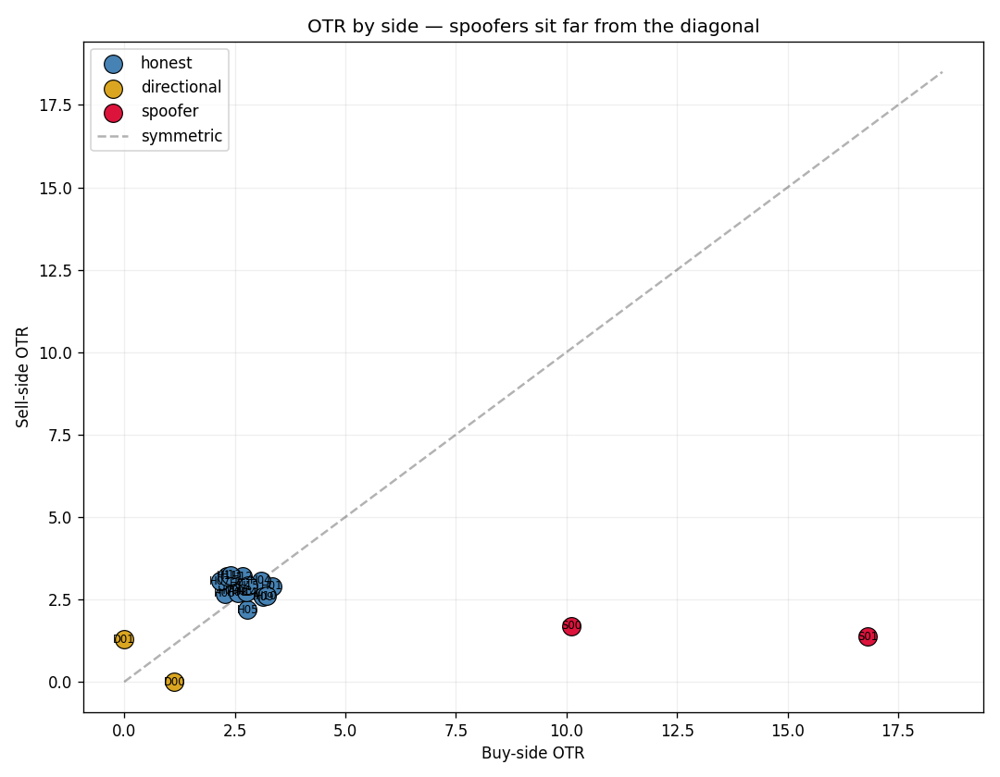
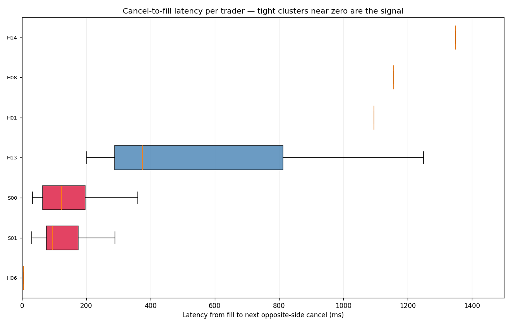

# Spoofing Detection Demo — Treasury Futures

Companion notebook to Issue 1 of the surveillance newsletter.

A walkthrough of three detection signals — order-to-trade ratio asymmetry, cancel-to-fill latency, and a composite score — applied to a synthetic population of 20 Treasury-futures traders, two of whom are systematically spoofing. The detection logic is illustrative, not production. Everything runs in under a minute on a laptop.

## What this notebook teaches

How three statistical signatures of spoofing show up in raw order data:

**1. OTR by side.** Spoofers' order-to-trade ratio is severely asymmetric — high on the phantom side, normal on the genuine side. Plotting buy-side OTR vs sell-side OTR per trader puts the spoofers far from the diagonal that honest market makers cluster around.



The two red dots in the top-left are the spoofers. They placed many orders on the buy side that almost never filled (high buy-OTR) while their sell-side OTR is normal — the phantom orders sit on the buy side, the genuine sells go through. Honest traders (blue) cluster tightly near the diagonal at low values: similar OTR on each side, both modest. Directional traders (gold) sit on the axes because they only trade one side.

**2. Cancel-to-fill latency.** Spoofers cancel their phantom orders within a few hundred milliseconds of their genuine fill on the opposite side. Honest traders' cancel timings are uncorrelated with their fills. The distribution gives them away.



Each row is one trader. The box shows the distribution of times between a fill and the next opposite-side cancel by the same trader, capped at 2 seconds. The two red rows at the top are the spoofers — 80 paired events each, tightly clustered around 100ms. The other rows are honest traders with 1–3 incidental pairings spread across the latency range. The spoofers' boxes are small and to the left. No honest workflow produces that pattern.

**3. Composite score.** Each signal alone has false positives. Combined and filtered (require two-sided activity for OTR asymmetry, require ≥10 paired observations for the latency signal), the composite cleanly separates spoofers from honest traders, directional traders, and noise. In the demo, the two spoofers score 5.4 and 5.8 standard deviations above the mean. The next highest score is 0.02. A 250x gap.

## What's deliberately absent

This is a demo, not a production detector. Things left out on purpose:

- Book-state reconstruction at fill time (depth contribution)
- Episode-level clustering across many fills
- Multi-instrument correlation
- RFQ-specific patterns for cash fixed income
- False-positive triage layer
- Real-time alerting and audit trail

Reach out via the newsletter if you'd want any of those as a paid notebook adapted to your venue's data format.

## How to run

```bash
pip install numpy pandas matplotlib
python spoofing_detection_demo.py
```

Or open `spoofing_detection_demo.ipynb` in Jupyter / VSCode / Colab and run all cells.

## License

MIT. Use it, fork it, ship a version with your own data — all fine.

## Feedback

This is the first release. If something is wrong, missing, or oversimplified, reply to the newsletter or open an issue. I read everything.
